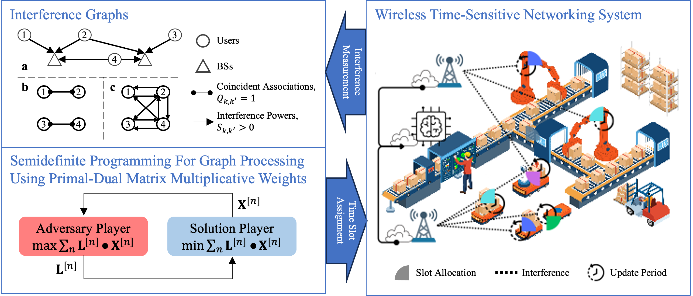

<h1 align="center">✨SIG-SDP-MMW✨</h1>

Source Codes for our paper, "[SIG-SDP: Sparse Interference Graph-Aided Semidefinite Programming for Large-Scale Wireless Time-Sensitive Networking](https://arxiv.org/pdf/2501.11307)," authored by Zhouyou Gu, Jihong Park, Branka Vucetic, Jinho Choi.

Reference
```bibtex
@article{gu2025sig,
  title={SIG-SDP: Sparse Interference Graph-Aided Semidefinite Programming for Large-Scale Wireless Time-Sensitive Networking},
  author={Gu, Zhouyou and Park, Jihong and Vucetic, Branka and Choi, Jinho},
  journal={arXiv preprint arXiv:2501.11307},
  year={2025}
}
```

## Installation
Clone this repo and run the following to install python packages
```
pip3 install -r requirements.txt
```
<mark>Please ensure the SCS backend of the cvxpy is properly installed in the above. See [here](https://www.cvxpy.org/tutorial/solvers/index.html).<mark>

## Reproducing Results in the Paper
All results in the paper can be reproduced using the scripts in [sim_script/journal_version](sim_script/journal_version)


## Recommended Development Setup
Clone the repo and its submodule; Install the dependency; Open the repo using vscode, where [.vscode](.vscode) contains the python path configurations, so the scripts can be simply clicked to be run.
